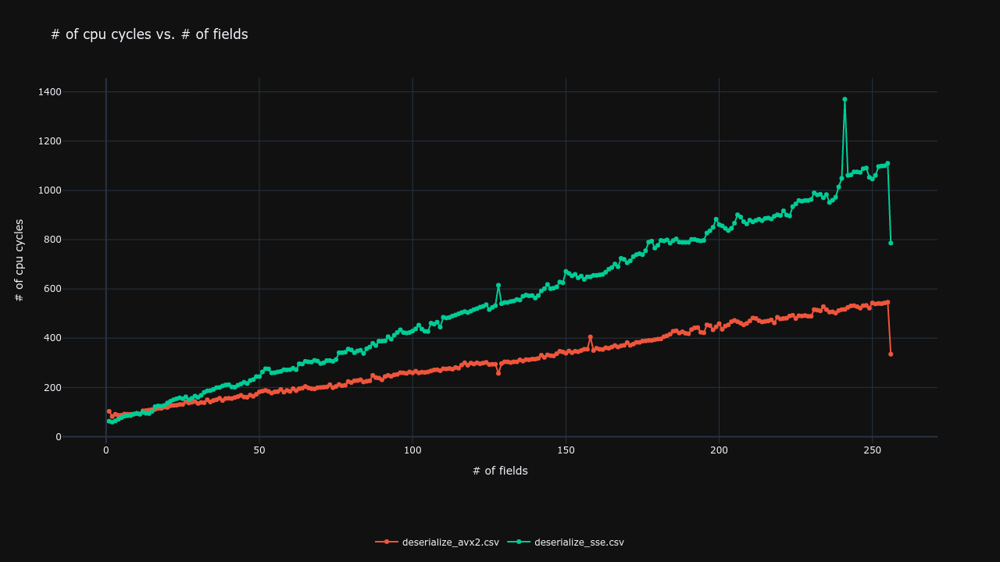
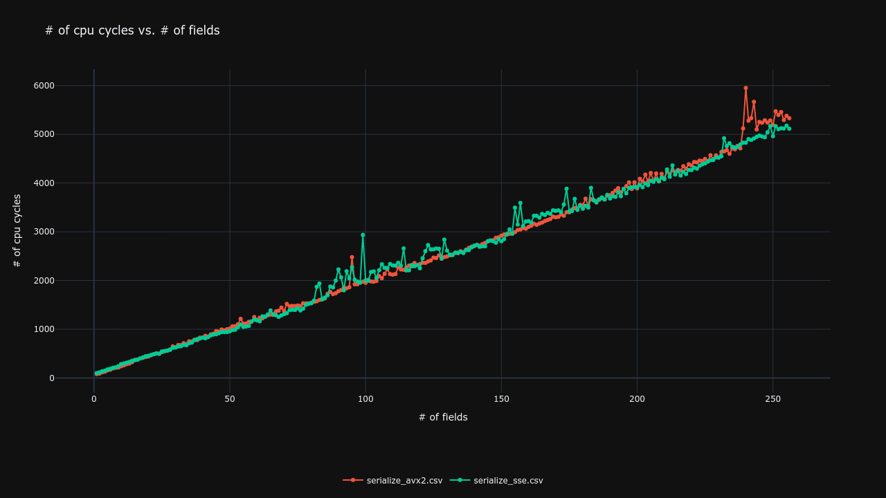

# Benchmarks

The benchmarks are the result of 1 million iterations per test, with randomly generated tags and values following a gaussian distribution.
Thy're are performed on the static library compiled following the [installation guide](installation.md) and they measure time complexity in terms of clock cycles rather than seconds, draw your own conclusions according to your CPU clock-speed.

### Comments:
  - The benchmarks were run using only aligned memory, mostly static, with exception for the actual random strings.
  - Serialization takes much more time than deserialization, as it involves copying the data to a buffer.
  - Deserialization is generally much faster as it uses zero-copy techniques.
  - Direct zero-copy serialization with vectorized writev and no memcpy was attempted but resulted in a 3x performance decrease, likely due to the small nature of the FIX fields and tags.

## Deserialization
  

## Serialization
  

## Run your own benchmarks

To run your own benchmarks you can follow the steps below:

  - Compile the library as described in the [installation guide](installation.md)
  - Compile the benchmark target: ```cmake --build . --target benchmark```
  - Run the benchmark executable: ```./benchmark```
  - Generate a plot with the results: ```python3 ./benchmarks/plot.py *.csv```