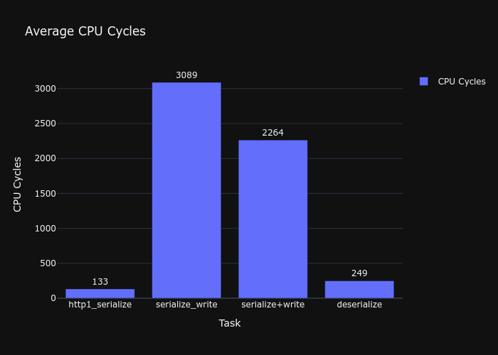

# Benchmarks

The benchmarks are the result of 1 million iterations per test, with randomly generated headers, path and body following a gaussian distribution. 
Thy're are performed on the static library compiled following the [installation guide](installation.md) and they measure execution speed in terms of clock cycles rather than seconds, draw your own conclusions according to your CPU clock-speed.

### Comments:

- The benchmarks were run using only aligned memory, mostly static, with exception for the actual random strings.
- For write operations, `/dev/null` was used as the output file. This is to not factor in external factors such as disk speed, buffering, blocking.

## HTTP1



## Run your own benchmarks

To run your own benchmarks you can follow the steps below:

- Compile the library as described in the [installation guide](installation.md)
- Compile the benchmark target: ```cmake --build . --target benchmark```
- Run the benchmark executable: ```./benchmark```